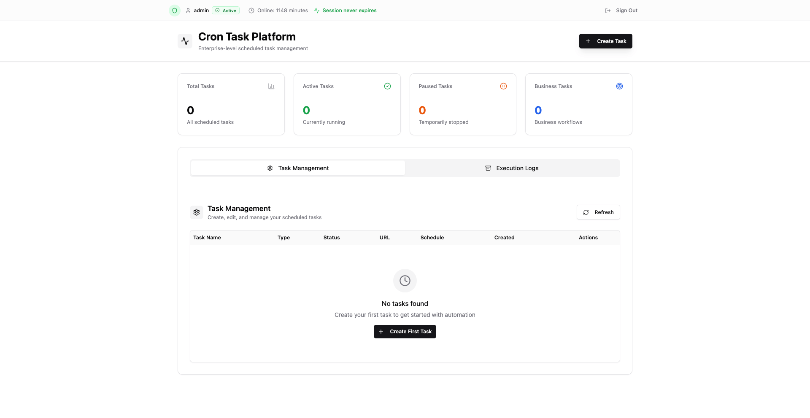
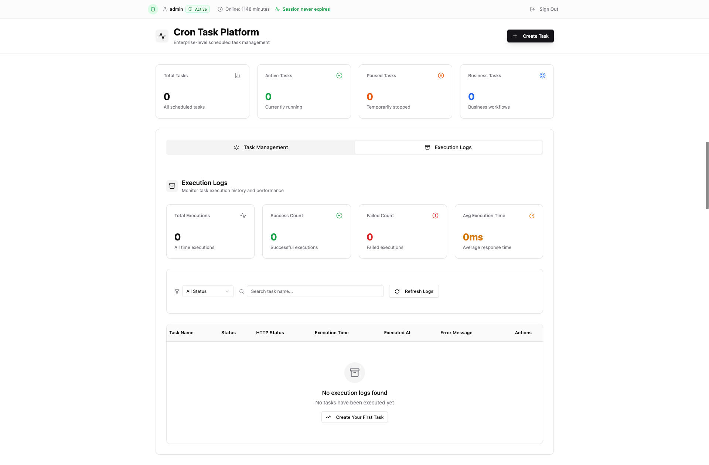

# Cron CLI (Alpha)

A universal CLI tool for creating and managing cron task management platforms.

⚠️ **Alpha Version Notice**: This is an alpha release. Features may change and stability is not guaranteed for production use.

## Interface





## Quick Start

### Create a new project

```bash
# Using the alpha version
npx @alex-programmer/cron@0.0.5-alpha create my-cron-project
cd my-cron-project
npm install
npm run dev
```

### Upgrade existing project

```bash
cd your-cron-project
npx @alex-programmer/cron@0.0.5-alpha upgrade
```

## Installation Options

### Use specific alpha version

```bash
npx @alex-programmer/cron@0.0.5-alpha create my-project
```

### Use latest alpha

```bash
npx @alex-programmer/cron@0.0.5-alpha create my-project
```

## Features

The generated project includes:

- ✅ **Modern Web Interface**: Built with Next.js and Shadcn
- ⏰ **Flexible Scheduling**: Support for various cron expressions (every second/minute/hour/day/month)
- 🔄 **Task Management**: Pause, resume, and test tasks with real-time feedback
- 📊 **Execution Monitoring**: Comprehensive logs and statistics
- 🎯 **Task Categories**: Business tasks and Keep Alive monitoring
- 🔧 **HTTP Configuration**: Custom headers and request body support
- 💾 **Data Persistence**: SQLite database with environment-specific storage
- 📱 **Responsive Design**: Works on mobile and desktop
- 🚀 **Easy Deployment**: Ready for production deployment

## Commands

### `cron create [project-name]`

Creates a new cron task management project.

**Options:**

- `-t, --template <template>`: Template to use (default: "default")

**Example:**

```bash
npx @alex-programmer/cron@0.0.5-alpha create my-scheduler
npx @alex-programmer/cron@0.0.5-alpha create my-scheduler --template default
```

### `cron upgrade`

Upgrades an existing project to the latest version while preserving your data and configurations.

**Options:**

- `-f, --force`: Force upgrade without confirmation

**Example:**

```bash
npx @alex-programmer/cron@0.0.5-alpha upgrade
npx @alex-programmer/cron@0.0.5-alpha upgrade --force
```

## What gets preserved during upgrades?

- ✅ SQLite database files (`cron_tasks.db`, `data/cron_tasks.db`)
- ✅ Environment files (`.env`, `.env.local`, `.env.production`)
- ✅ Project name and custom package.json configurations
- ✅ Any custom data you've added

## What gets updated during upgrades?

- 🔄 Core application files (`app/`, `components/`, `lib/`, `types/`)
- 🔄 Configuration files (`next.config.ts`, `tsconfig.json`, etc.)
- 🔄 Dependencies in `package.json`
- 🔄 Build scripts and tooling
